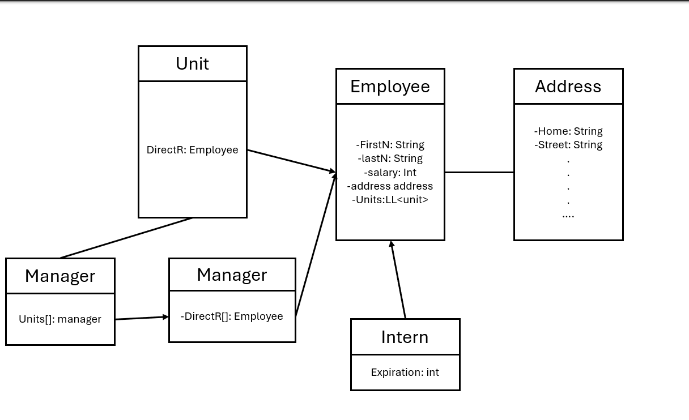

## Question 1
### basic types:
- int a
- double b
### Objects:
- int c[]
- String s

## Question 2
<ol type="a">
  <li>What is a static Method</li>
    <ul>
    <li>A static method in java is a method that works on a static version of the object. </li>
    <li>This means that instead of using a constructor to make an object, and then altering it's values with a method
      You can simply run the method, and it alters the static variables</li>
    </ul>
  <li>Why is the main method static</li>
    <ul>
    <li>The main method needs to be static because there is no object created of the main class</li>
    <li>If you tried to call non static main without calling it on an object it would throw an error</li>
    </ul>
</ol>

## Question 3
 1. Wrong
 2. Correct

## Question 4
- This returns false, since java passes by value and you are attempting to turn a string into a new string, which would change the value, but not any field stored within it.

## Question 5
- The main method returns "X: 0 Y: 0"

## Question 6
- The private declaration for the variable and function means that only code within the same class can acess it, this achieves proper encapsulation, since outside code cannot acess it.

## Question 7
- Java chooses between the two constructors by looking at what parameters were given
  - If two doubles were given it uses the first definition
  - If a point was given it uses the second definition
 
## Question 8
- Option 4 is correct since it is the only option that entirely utilizes public methods, options 1,2,3, and 5 try to either set or get using code that is not available to them

## Question 9
- The output is the string version of the point pair with the values x=0 and y=0
- (toString is not definied for this string so technically nothing would get returned, but I assume this was not intentional)
## Question 10
- The output would be the string representation of the point x=10 and y=10

## Question 11
- 2 is the only valid overwrite.
- 1. attempts to acess a private method
- and 2 and 3 both do not overwrite by having a new name.

## question 12
- protected allows child classes to access but otherwise acts like private.

## Question 13 
```

public class FormulaOne extends Racecar {
  private String make=null;
  public FormulaOne(){
    super();
  }
  public FormulaOne(String make){
    super();
    this.make=make;
  }
  public String toString(){
    return(super.toString+" Make "+make);
  }
  public String getMake(){
    return(make);
  }
  public void setMake(String make){
    this.make=make;
  }
}
```
## Question 14 
- Neither A nor B would work since add Sponsor is protected it can't be called without being inherited

## Question 15

